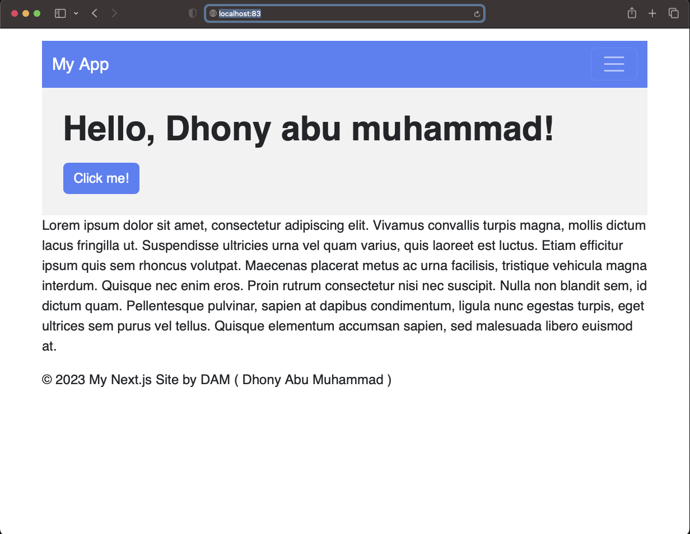
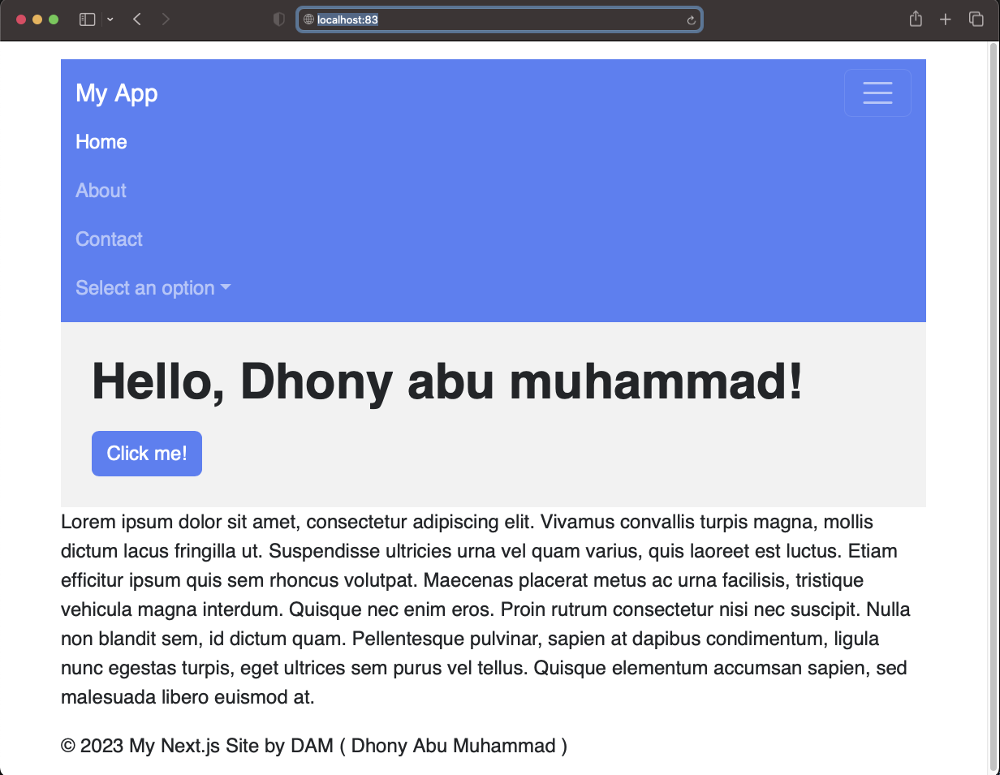
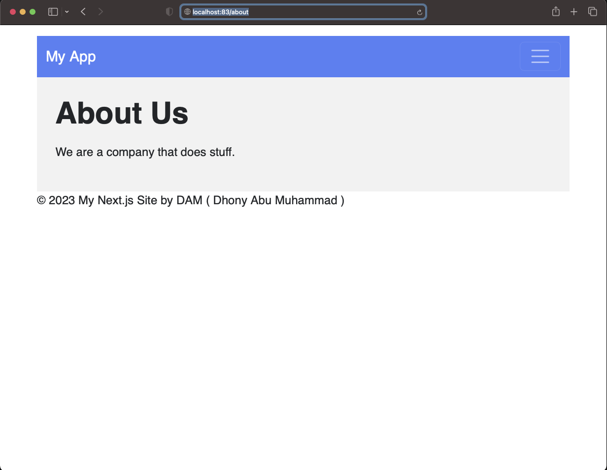
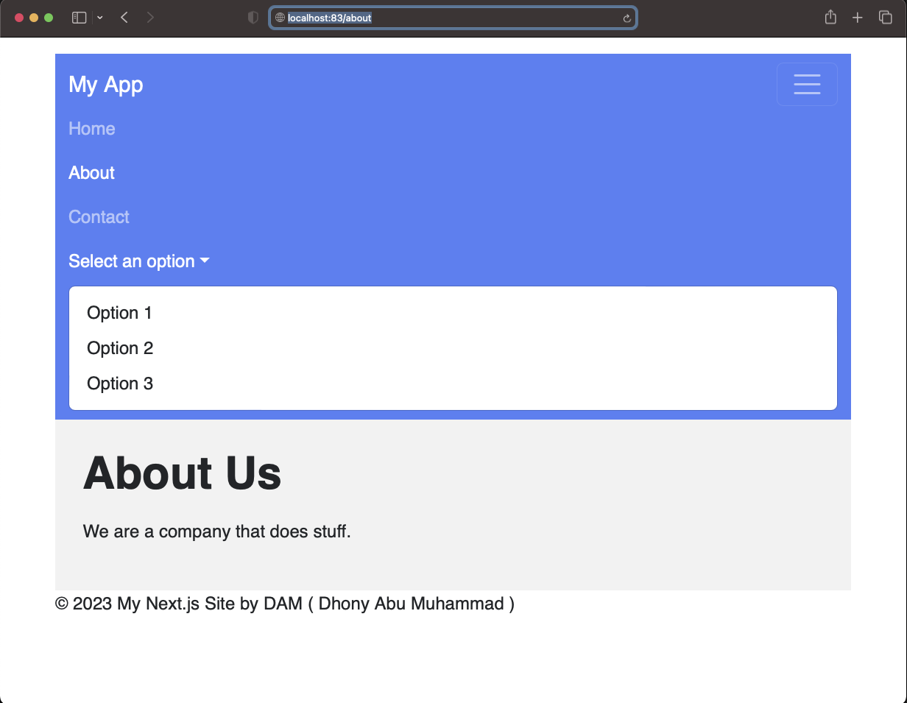

# NEXTJS - testing hello world
---

build image

	❯ docker build . -t damvhellonavbarbootstrap-mynextjs --target runner

test run container

	❯ docker run -d --name damvmynextjshellonavbarbootstrap -p 83:3000 damvhellonavbarbootstrap-mynextjs

check kedalam container

	❯ docker exec -it damvmynextjshellonavbarbootstrap /bin/sh

open browser

	URL http://localhost:83

---

    

    

    

    

---

### DEPLOY FLY.IO

	❯ flyctl apps create --name damvhellonavbarbootstrap-mynextjs
	
	
	❯ flyctl deploy
	
	
	❯ flyctl open
